# Oui,Key Leaks

<p align="center">
  
</p>


## Scenario

*OuiKeyLeaks have been seized for publishing a bad article about drones! 
Out of curiosity, can you help us pentesting this website ? Try retrieving the admin's password hash.  
Spoiler : It's going to take some escalation !  
Have fun.*

## Step 1

The challenge provided a domain and port to connect to.
After connecting to the website, we see this page:

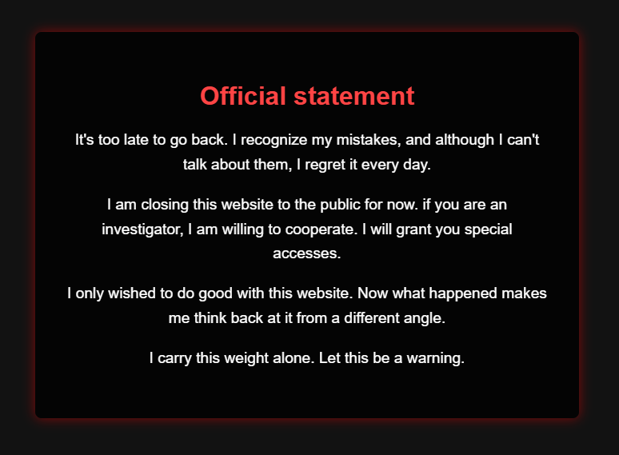

Inspecting the page's source code reveals the following:

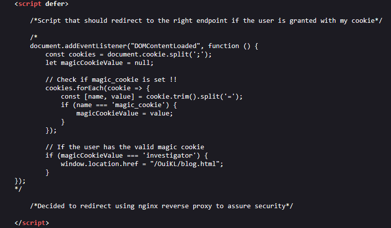

The script checks if a cookie named magic_cookie exists and if its value is set to investigator. If both conditions are true, the user is redirected to `/OuiKL/blog.html`.
We can manually set this cookie using the browser's developer console and then refresh the page:

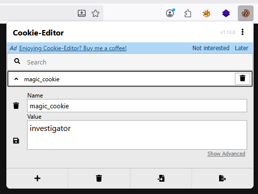

Setting the cookie and reloading the page bypasses the check, revealing a new message:

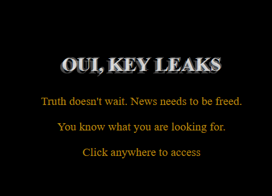

## Step 2

This page reveals a new requirement: access to the admin page is protected and requires an additional cookie.

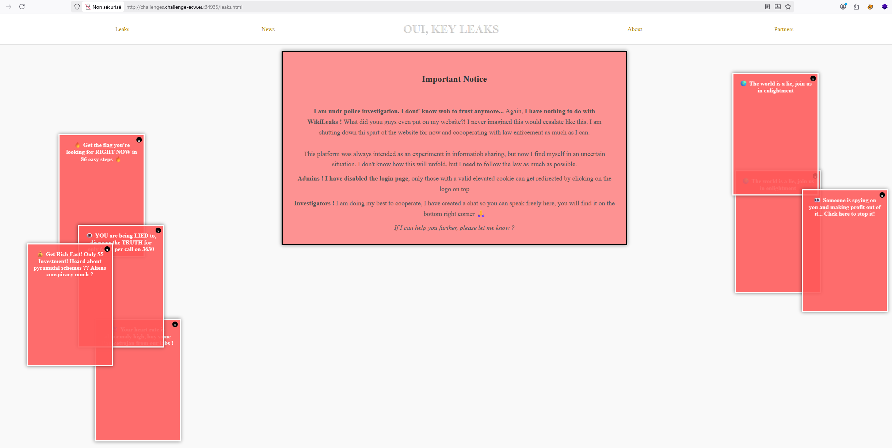

The page features a chat widget in the bottom right corner.

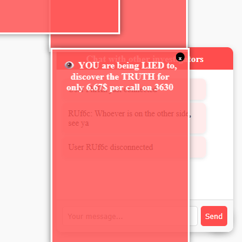

We attempt to inspect the chat service, but the messages are completely obscured by a large advertisement.
Separately, in the bottom left corner of the page, we find the following:


While inspecting the application's cookies, we discover a cookie named premium set to false.
This seems directly related to the advertisement. We test this hypothesis by changing the cookie's value to true and reloading the page.
As expected, the advertisement is now gone, and we can clearly see the chat service.

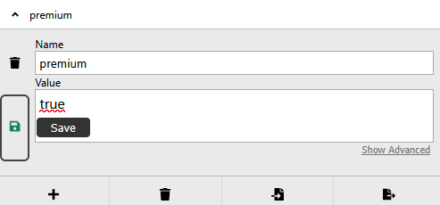

The chat window displays messages from other 'investigators'. Since this is an input field where our text is displayed back to other users, it's a prime candidate for a Cross-Site Scripting (XSS) vulnerability.
We test this hypothesis by injecting a basic XSS payload:
``

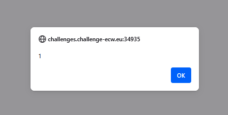

The initial alert(1) payload executed successfully, confirming the XSS vulnerability.
The next objective is to steal the session cookie of an elevated user, presumably an admin. We noted that the chat relies on WebSockets for communication. This provides a convenient exfiltration path: we can use the existing `socket.send()` function to send the cookie data directly back into the chat, where we can see it.

We inject the following payload:
``

This payload will trigger when loaded by any user (hopefully an admin), sending their `document.cookie` as a new message.
We submit the payload and wait. Sure enough, a new message appears in the chat a few moments later, containing the admin's cookie.

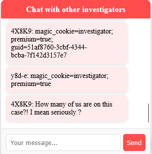

We now replace our own cookie with the stolen admin cookie: `guid:51af8760-3cbf-4344-bcba-7f142d3157e7`.
With this cookie set, we navigate to the admin page and are successfully granted access.

## Step 3

The admin panel is now displayed:

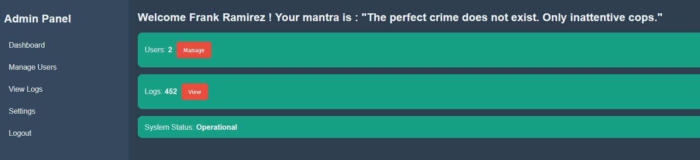

In the "View Logs" menu, we find this interesting log:

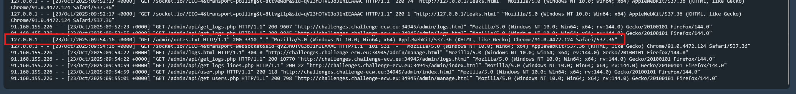

Further exploration of the admin panel reveals a `/admin/notes.txt` file.
This file contains an interesting snippet: the source code for `user.php`:

```php
<?php
header("Content-Type: application/json");
require_once '../config/config.php'; // Connexion PDO

// Check if guid is present
if (isset($_COOKIE['guid'])) {
    $guid = $_COOKIE['guid'];

    $query = "SELECT name, secret FROM users WHERE guid = '$guid'"; 
    $result = $pdo->query($query);
    $userData = $result->fetch(PDO::FETCH_ASSOC);

    if ($userData) {
        echo json_encode([
            "success" => true,
            "name" => $userData['name'],
            "secret" => $userData['secret']
        ]);
    } else {
        echo json_encode(["success" => false, "message" => "Unknown GUID"]);
    }
} else {
    echo json_encode(["success" => false, "message" => "No guid found..."]);
}
?>
```

The previously discovered `user.php` source code confirms that the guid cookie value is concatenated directly into an SQL query string, creating a clear SQL injection vulnerability.
We move to Burp Suite's Repeater to test this. After capturing a valid request, we append a single quote (`'`) to the guid cookie value.
Sending this modified request causes the server to respond with a 500 Internal Server Error. This unhandled exception is a strong confirmation that the application is vulnerable to SQL injection.

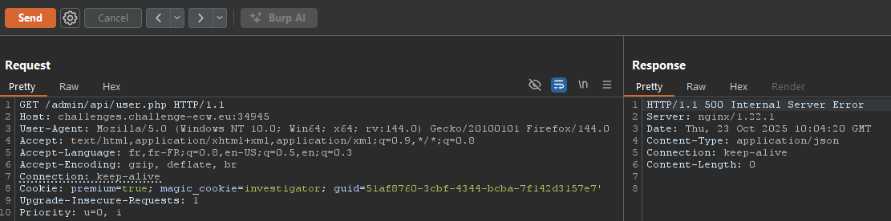

First, we identify the database version to confirm the technology.

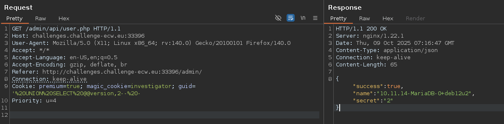

Next, we list all available database names. We use `GROUP_CONCAT` to exfiltrate all of them in a single response.

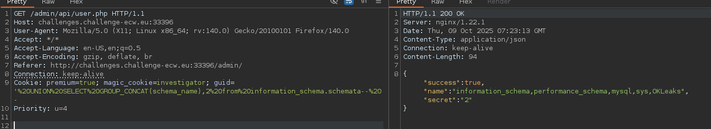

After identifying the target database (`OKLeaks`), we enumerate all its table names.

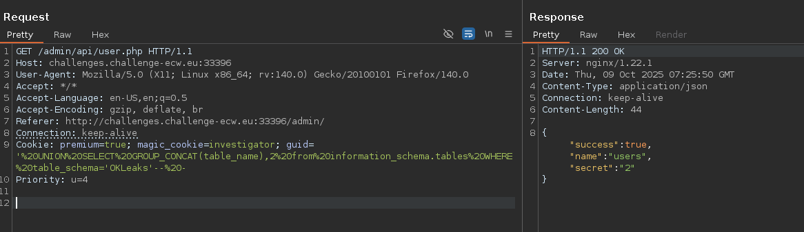

Once we find an interesting table (`users`), we list its column names.

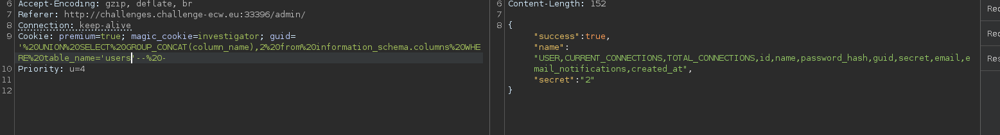

Finally, knowing the full path, we can construct the final query to extract the flag:

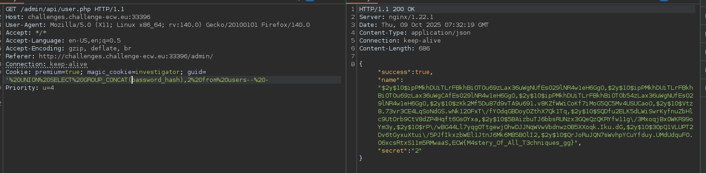

`ECW{M4stery_Of_All_T3chniques_gg}`

